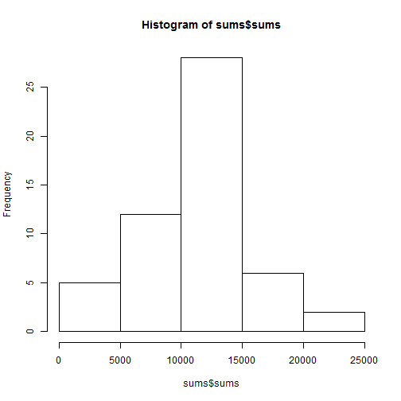
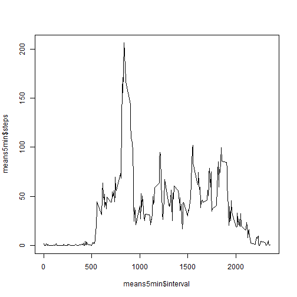
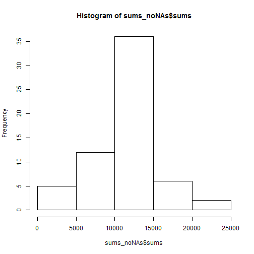
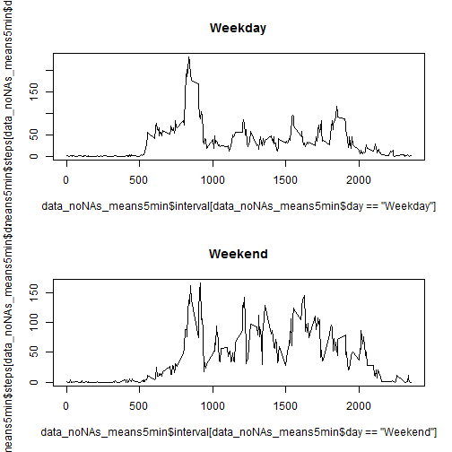

Bartosz Janeczek
Reproducible Research - Assignment 1
====
## Loading and preprocessing the data
First what I need is to download source data, unzip it, convert date format.

```r
temp <- tempfile()
download.file("http://d396qusza40orc.cloudfront.net/repdata%2Fdata%2Factivity.zip",temp)
data <- read.csv(unz(temp, "activity.csv"),colClasses=c("integer","character","integer"))
unlink(temp)
data$date=as.Date(as.character(as.vector(data$date)), format="%Y-%m-%d")
```
## What is mean total number of steps taken per day?
Let's calculate it.

```r
sums=aggregate(steps~date, data=data, FUN=sum)
colnames(sums)[2]<-"sums"
print(sums)
```

```
##          date  sums
## 1  2012-10-02   126
## 2  2012-10-03 11352
## 3  2012-10-04 12116
## 4  2012-10-05 13294
## 5  2012-10-06 15420
## 6  2012-10-07 11015
## 7  2012-10-09 12811
## 8  2012-10-10  9900
## 9  2012-10-11 10304
## 10 2012-10-12 17382
## 11 2012-10-13 12426
## 12 2012-10-14 15098
## 13 2012-10-15 10139
## 14 2012-10-16 15084
## 15 2012-10-17 13452
## 16 2012-10-18 10056
## 17 2012-10-19 11829
## 18 2012-10-20 10395
## 19 2012-10-21  8821
## 20 2012-10-22 13460
## 21 2012-10-23  8918
## 22 2012-10-24  8355
## 23 2012-10-25  2492
## 24 2012-10-26  6778
## 25 2012-10-27 10119
## 26 2012-10-28 11458
## 27 2012-10-29  5018
## 28 2012-10-30  9819
## 29 2012-10-31 15414
## 30 2012-11-02 10600
## 31 2012-11-03 10571
## 32 2012-11-05 10439
## 33 2012-11-06  8334
## 34 2012-11-07 12883
## 35 2012-11-08  3219
## 36 2012-11-11 12608
## 37 2012-11-12 10765
## 38 2012-11-13  7336
## 39 2012-11-15    41
## 40 2012-11-16  5441
## 41 2012-11-17 14339
## 42 2012-11-18 15110
## 43 2012-11-19  8841
## 44 2012-11-20  4472
## 45 2012-11-21 12787
## 46 2012-11-22 20427
## 47 2012-11-23 21194
## 48 2012-11-24 14478
## 49 2012-11-25 11834
## 50 2012-11-26 11162
## 51 2012-11-27 13646
## 52 2012-11-28 10183
## 53 2012-11-29  7047
```
and produce histogram

```r
hist(sums$sums)
```

 

and find mean and median of the total number of steps taken per day

```r
summary(sums$sums)[3:4]
```

```
## Median   Mean 
##  10760  10770
```

## What is the average daily activity pattern?
Lets aggregate data against 5-minute intervals, plot it

```r
means5min=aggregate(steps~interval, data=data, FUN=mean)
plot(x=means5min$interval,means5min$steps,type = "l")
```

 

And find which 5-minute interval, on average across all the days in the dataset, contains the maximum number of steps

```r
means5min$interval[means5min$steps==max(means5min$steps)]
```

```
## [1] 835
```

## Imputing missing values
Total number of missing values in the dataset (i.e. the total number of rows with NAs).

```r
sum(is.na(data$steps))
```

```
## [1] 2304
```

Lets use 5-min interval mean for missing values and create a new dataset that is equal to the original dataset but with the missing data filled in.

```r
data_noNAs <- merge(data,means5min,by.x="interval",by.y="interval",suffixes=c("","M"))
data_noNAs$steps[is.na(data_noNAs$steps)] <- data_noNAs$stepsM[is.na(data_noNAs$steps)]
```

Now lets make a histogram of the total number of steps taken each day and calculate and report the mean and median total number of steps taken per day. 


```r
sums_noNAs=aggregate(steps~date, data=data_noNAs, FUN=sum)
colnames(sums_noNAs)[2]<-"sums"
hist(sums_noNAs$sums)
```

 

```r
summary(sums_noNAs$sums)[3:4]
```

```
## Median   Mean 
##  10770  10770
```

These values do not differ much from the estimates from the first part of the assignment (only median is sligtly different). The most difference is in frequences (please see histogram) - we have more filled values with no importand change of overall statistics.

## Are there differences in activity patterns between weekdays and weekends?

Create a new factor variable in the dataset with two levels – “weekday” and “weekend” indicating whether a given date is a weekday or weekend day.

```r
Sys.setlocale("LC_TIME", "English")
```

```
## [1] "English_United States.1252"
```

```r
data_noNAs$day[weekdays(data_noNAs$date) %in% c("Saturday","Sunday")]<-"Weekend"
data_noNAs$day[is.na(data_noNAs$day)]<-"Weekday"
data_noNAs$day=as.factor(data_noNAs$day)
```

Make a panel plot containing a time series plot (i.e. type = "l") of the 5-minute interval (x-axis) and the average number of steps taken, averaged across all weekday days or weekend days (y-axis). 

```r
par(mfrow=c(2,1))
data_noNAs_means5min=aggregate(steps~interval+day, data=data_noNAs, FUN=mean)
plot(x=data_noNAs_means5min$interval[data_noNAs_means5min$day=="Weekday"],data_noNAs_means5min$steps[data_noNAs_means5min$day=="Weekday"],type = "l",main="Weekday")
plot(x=data_noNAs_means5min$interval[data_noNAs_means5min$day=="Weekend"],data_noNAs_means5min$steps[data_noNAs_means5min$day=="Weekend"],type = "l",main="Weekend")
```

 

